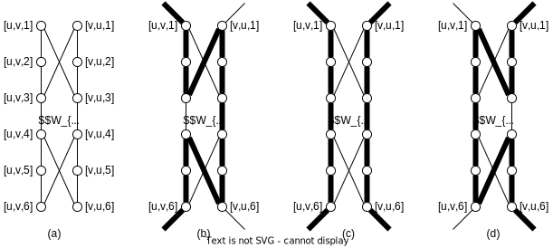

<h1>
近似算法
</h1>

BY  唐志鹏  SA23011068

## 题目 1

**引理**：完全图的最小 $2$ 匹配 $S$ 将图分为若干个连通片，且每个连通片都是环（自然地，每个连通片至少包含 $3$ 个顶点）

**证明**：假设某个连通片不是环，那么存在以下两种情况：

- 该连通片中存在环，那么至少存在一个环外的点 $u$ 和一个环内的点 $v$ 是相连的（否则，不连通）。于是，$v$ 至少有 $3$ 条相邻的边，这与 $S$ 是 $2$ 匹配矛盾！
- 该连通片中不存在环，那么该连通片就是树，叶子节点只有 $1$ 条相邻的边，这也与 $S$ 是 $2$ 匹配矛盾！

因此，结论成立！

**算法**：

- step1: 首先，找到完全图 $G$ 的最小 $2$ 匹配 $S$，包含 $k$ 个环 $C = \{C_1, C_2, ..., C_k\}$
- step2: 在每个环 $C_i$ 中随意取一条边 $(u_i,v_i)$，删除这些边，然后连接顶点 $(v_j, u_{j+1})$，$1\leq j \leq k-1$，和 $(v_k,u_1)$
- step3: 输出上述结果 $\mathcal{T}$

**时间复杂度**：上述每一步都可以在多项式时间内完成，因此是多项式时间复杂度

**正确性**：

首先，问题的最优解 $\text{OPT}$ 是一个经过所有顶点的环，即：$\text{OPT}$ 也是图 $G$ 的一个 $2$ 匹配，因此，$cost(C) \leq \text{OPT}$

由于 $C$ 中的每个环至少包含 $3$ 个顶点，因此，$k\leq \frac{n}{3}$

在 step2 中，我们删除了 $k$ 条边，同时添加了 $k$ 条边，在最坏情况下，删除的边的权均为 $1$，而添加的边的权均为 $2$，因此，
$$
\begin{align}
cost(\mathcal{T}) &\leq cost(C) - k + 2k \\
& = cost(C) + k \\
& \leq cost(C) + \frac{n}{3}
\end{align}
$$
由于 $C$ 中恰好包含 $n$ 条边，且权至少为 $1$，因此，$cost(C) \geq n$
$$
\begin{align}
cost(\mathcal{T}) &\leq cost(C) + \frac{n}{3} \\
& \leq cost(C) + \frac{cost(C)}{3} \\
& = \frac{4}{3} cost(C) \\
& \leq \frac{4}{3}\text{OPT}
\end{align}
$$
综上所述，该算法是这种特殊 TSP 问题的 $\frac{4}{3}$ 近似算法

## 题目 2

设每个布尔变量 $x_i, (1\leq i \leq n)$ 对应的值为 $y_i \in \{-1,1\}$，设 $y_0 \in \{-1,1\}$，且
$$
x_i = \begin{cases}
TRUE, & \text{if}\ y_i=y_0 \\
FALSE, & \text{otherwise}
\end{cases}
$$
这种情况下，我们可以用 $y_i$ 来表示每个子句 $C$ 的值 $v(C)$，如果 $C$ 被满足，则 $v(C)=1$，否则，$v(C)=0$。对于只有一个文字的子句，
$$
\begin{align}
& v(x_i) = \frac{1+y_0 y_i}{2} \\
& v(\neg x_i) = \frac{1-y_0 y_i}{2}
\end{align}
$$
对于包含两个文字的子句，有，
$$
\begin{align}
v(x_i \lor x_j) &= 1 - v(\neg x_i) v(\neg x_j) \\
&= 1 - \frac{1-y_0 y_i}{2} \cdot \frac{1-y_0 y_j}{2} \\
&= \frac{1+y_0 y_i}{4} + \frac{1+y_0 y_j}{4} + \frac{1-y_i y_j}{4} \\

v(\neg x_i \lor x_j) &= \frac{1-y_0 y_i}{4} + \frac{1+y_0 y_j}{4} + \frac{1+y_i y_j}{4} \\

v(x_i \lor \neg x_j) &= \frac{1+y_0 y_i}{4} + \frac{1-y_0 y_j}{4} + \frac{1+y_i y_j}{4} \\

v(\neg x_i \lor \neg x_j) &= \frac{1-y_0 y_i}{4} + \frac{1-y_0 y_j}{4} + \frac{1-y_i y_j}{4} \\
\end{align}
$$
不难发现，只包含两个文字的子句的值都是 $1+y_iy_j$ 和 $1-y_i y_j$ 的线性组合，合并同类项，将每一项的因数分别记为 $a_{ij},b_{ij} \geq 0$，我们可以将目标函数写为，
$$
\begin{align}
&\max \sum_{0\leq i < j \leq n} [a_{ij}(1+y_i y_j)+b_{ij}(1-y_i y_j)]& \\
&s.t.\ y_i \in \{-1,1\} & 0 \leq i \leq n
\end{align}
$$
我们这样设置 SDP 问题：假设 $y_i$ 对应向量 $\boldsymbol{v}_i$
$$
\begin{align}
&\max \sum_{0\leq i < j \leq n} [a_{ij}(1+ \langle \boldsymbol{v}_i, \boldsymbol{v}_j \rangle)+b_{ij}(1-\langle \boldsymbol{v}_i, \boldsymbol{v}_j \rangle)]& \\
&s.t.\ \langle \boldsymbol{v}_i, \boldsymbol{v}_j \rangle=1 & 0 \leq i \leq n \\
& \ \ \ \ \ \ \ \ \ \boldsymbol{v}_i \in \mathbb{R}^{n+1} & 0 \leq i \leq n
\end{align}
$$
**算法**：SDP-MAX-2SAT

- step1: 解决上述 SDP 问题，得到最优解 $\boldsymbol{v}_i, 0 \leq i \leq n$

- step2: 均匀随机选择一个单位向量 $\boldsymbol{r} \in \mathbb{R}^{n+1}$

- step3: 设置 $y_i, 0\leq i \leq n$
  $$
  y_i = \begin{cases}
  1, & \text{if}\ \langle \boldsymbol{r}, \boldsymbol{v}_j \rangle \geq 0 \\
  -1, & \text{otherwise}
  \end{cases}
  $$

- step4: 设置 $x_i, 1\leq i \leq n$
  $$
  x_i = \begin{cases}
  TRUE, & \text{if}\ y_i=y_0 \\
  FALSE, & \text{otherwise}
  \end{cases}
  $$
  

**时间复杂度**：上述每一步都可以在多项式时间内完成，因此是多项式时间复杂度

**正确性**：

设 $W$ 为满足的子句的数量，则
$$
W = \sum_{0\leq i < j \leq n} [a_{ij}(1+y_i y_j)+b_{ij}(1-y_i y_j)]
$$
设 $\theta_{ij}\in [0,\pi]$ 为 $\boldsymbol{v}_i$ 和 $\boldsymbol{v}_j$ 之间的夹角，根据课件中对 SDP-MAXCUT 算法的分析，有
$$
\begin{align}
& \text{Pr}[y_i y_i=-1] = \frac{2\theta_{ij}}{2\pi}=\frac{\theta_{ij}}{\pi} \geq 0.878 \cdot \frac{1-\cos{\theta_{ij}}}{2} \\
& \text{Pr}[y_i y_i=1] = 1-\frac{\theta_{ij}}{\pi} \geq 0.878 \cdot \frac{1+\cos{\theta_{ij}}}{2}
\end{align}
$$
因此，
$$
\text{E}[y_i y_j] = 1 \cdot \text{Pr}[y_i y_i=1] + (-1) \cdot \text{Pr}[y_i y_i=-1] = 1 - \frac{2\theta_{ij}}{\pi}
$$
进一步，
$$
\begin{align}
\text{E}[W] 
&= \text{E}[\sum_{0\leq i < j \leq n} [a_{ij}(1+y_i y_j)+b_{ij}(1-y_i y_j)]] \\
&= \sum_{0\leq i < j \leq n} [a_{ij}(1+\text{E}[y_i y_j])+b_{ij}(1-\text{E}[y_i y_j])] \\
&= \sum_{0\leq i < j \leq n} [a_{ij}(2-\frac{2\theta_{ij}}{\pi})+b_{ij} \cdot \frac{2\theta_{ij}}{\pi}] \\
&= 2 \sum_{0\leq i < j \leq n} [a_{ij}(1-\frac{\theta_{ij}}{\pi})+b_{ij} \cdot \frac{\theta_{ij}}{\pi}] \\
&\geq 0.878 \sum_{0\leq i < j \leq n} [a_{ij}(1+\cos{\theta_{ij}})+b_{ij} (1+\cos{\theta_{ij}})] \\
&= 0.878 \sum_{0\leq i < j \leq n} [a_{ij}(1+\langle \boldsymbol{v}_i, \boldsymbol{v}_j \rangle)+b_{ij} (1+\langle \boldsymbol{v}_i, \boldsymbol{v}_j \rangle)] \\
&= 0.878 \cdot \text{OPT}_{\text{SDP}} \\
&\geq 0.878 \cdot \text{OPT}
\end{align}
$$
因此，SDP-MAX-2SAT 是该问题的一个 $0.878$-近似算法

## 题目 3

如果城市之间的距离满足三角不等式，那么该问题可以抽象为 k-center 问题

**贪心算法**：

- step1: $S \leftarrow \emptyset$ （$S$ 为最终选择的 $k$ 个城市的集合）
- step2: 对于每个城市 $u$，初始化 $d[u]=\infty$（$d[\ .]$ 为每个城市到当前 $S$ 的最近距离）
- step3: 重复下面步骤 $k$ 次
  - 选择一个城市 $v$，使得 $d[v]$ 最大
  - 将 $v$ 加入到 $S$ 中
  - 对于每个城市 $u$，更新 $d[u]=\min\{d[u], d(u,v)\}$（$d(u,v)$ 表示两个城市之间的距离）
- step4: 返回 $S$

**时间复杂度**：选择每个新的中心花费 $O(n)$ 时间，因此，总的时间复杂度为 $O(nk)$

**正确性**：

**引理** 假设存在 $k+1$ 个城市 $u_1,...,u_{k+1}$，使得 $d(u_i,u_j)>2R$ 对所有的 $i \neq j$ 成立。那么有 $\text{OPT}>R$，$\text{OPT}$ 是最优解的最小化的距离

**证明**：假设 $\text{OPT}\leq R$，那么存在 $k$ 个城市 $v_1,...,v_k$ 诱导出 $k$ 个聚类 $C_1,...,C_k$（即到每个中心城市最近的城市组成的集合）使得，对于，每个 $C_h$ 和 $p\in C_h$，$d(p,v_h) \leq R$。根据鸽巢原理，引理中的 $k+1$ 个城市中，存在两个城市 $u_i,u_j(i \neq j)$ 在同一个聚类 $C_h$ 中，于是，
$$
d(u_i,u_j)\leq d(u_i,v_h)+d(u_j,v_h) \leq 2R
$$
矛盾！因此，引理成立！

设贪心算法的输出为 $S=\{u_i,...,u_k\}$，算法最后得到的最小化的距离为 $D=\max_{v为某个城市}{d(v,S)}$

假设 $D > 2 \cdot \text{OPT}$，那么，存在一个城市 $v$ 使得 $d(v,S) > 2\cdot \text{OPT}$；这里可以看出 $v\notin S$

由于贪心算法每次都选择距离 $S$ 最远的点，并且每次迭代中都没有选择 $v$，因此有，
$$
d(u_i,\{u_1,...,u_{i-1}\}) > 2 \cdot \text{OPT},\ i=2,...,k
$$
于是，$\{u_i,...,u_k,v\}$ 这 $k+1$ 个城市两两之间的距离大于 $2\cdot \text{OPT}$

根据引理得，$\text{OPT}>\text{OPT}$，矛盾！

因此，$D \leq 2\cdot \text{OPT}$，即：上述算法得到的距离最多是最优解的 $2$ 倍

## 题目 4

对于点覆盖问题的 2-近似算法的输出 $S$，显然满足 $|S| \leq 2|S^*|$。因此可以得到独立集问题的一个解$I=V\setminus S$，因此，
$$
|I|=|V|-|S|\geq |V|-2|S^*|
$$
那么。对于独立集问题的近似比为 $\frac{|I|}{|I^*|}=\frac{|V\setminus S|}{|V\setminus S^*|}=\frac{|V|-2|S^*|}{|V|-|S^*|}$。当 $|S^*|=\frac{|V|}2$ 时，近似比为 $0$。

所以，给定一个点覆盖问题的 2-近似算法，并不能得到一个最大独立集问题的 $\frac{1}{2}$-近似算法

## 题目 5

> 前提：独立集问题和点覆盖问题都是 NP-完全问题

### 旅行商问题

**引理** 哈密顿回路问题是 NP-完全问题

> 哈密顿回路问题：无向图 $G=(V,E)$ 中是否存在哈密顿回路？

**证明**：

先说明哈密顿回路问题属于 NP。已知一个图 $G=(V,E)$，我们选取的证书是形成哈密顿回路的 $|V|$ 个顶点所组成的序列。验证算法检查这一序列包含 $V$ 中每个顶点一次（第一个顶点会在末尾重复出现一次），并且它们在 $G$ 中形成一个回路。也就是说，要检查序列中相邻两个顶点之间是否都存在一条边。显然，我们可以在多项式时间内验证。因此，哈密顿回路问题属于 NP

**下面证明**：点覆盖问题 $\leq_P$ 哈密顿回路问题

给定一个无向图 $G=(V,E)$ 和一个整数 $k$，构造一个无向图 $G'=(V',E')$，使得它包含一个哈密顿回路，当且仅当 $G$ 中有一个大小为 $k$ 的顶点覆盖

对于 $G$ 中的每条边 $(u,v)\in E$，先构造一个子图 $W_{uv}$（这些子图都是 $G'$ 的一部分），其包含 $12$ 个顶点，分别用 $[u,v,i],[v,u,i]$（$1\leq i \leq 6$）表示，包含 $14$ 条边，具体结构如下图 (a) 所示：

特别地，子图中只有顶点 $[u,v,1],[u,v,6],[v,u,1],[v,u,6]$ 这四个顶点包含与 $G'$ 其它部分相邻的边。$G'$ 中的任何哈密顿回路都必定以上图 (b)~(d) 中所示三种方法中的某一种来遍历 $W_{uv}$ 中的边。

除了子图中的顶点之外，$V'$ 中唯一的的其它顶点为选择器顶点 $s_1,s_2,...,s_k$。

除了子图中的边之外，$E'$ 中还有两类边：

- 首先，对于每个顶点 $u\in V$，都加入一些边来连接一对一对的子图，从而形成一条路径，它包含了所有对应于 $G$ 中与 $u$ 关联的的边的子图。对于与每个顶点 $u\in V$ 的所有顶点，将其任意地排序为 $u^1,u^2,...,u^{\text{degree}(u)}$。将如下边都加入到 $E'$ 中：
  $$
  \{ ([u,u^i,6], [u,u^{i+1},1]): 1 \leq i \leq \text{degree}(u)-1 \}
  $$
- $E'$ 中最后一类边是将上述 $[u,u^1,1]$ 和 $[u,u^{\text{degree}(u)},6]$ 与每个选择器顶点连接，包含以下边：
  $$
  \{ (s_j, [u,u^1,1]):u\in V, 1\leq j \leq k \} \cup \{ (s_j, [u,u^{\text{degree}(u)},1]):u\in V, 1\leq j \leq k \}
  $$

接着，我们要证明 $G'$ 的规模是 $G$ 的规模的多项式，因而可以在多项式时间内构造出 $G'$。

- 首先，$G'$ 的顶点包含子图顶点和选择器顶点。每个子图包含 $12$ 个顶点，因此，
  $$
  |V'|=12|E| + k \leq 12|E| + |V|
  $$

- $G'$ 中的边包括子图内的边，子图之间的边和子图与选择器顶点之间的边，三个部分的总和为：
  $$
  |E'| = (14|E|) + \left( \sum_{u\in V}(\text{degree}(u)-1) \right) + (2k|V|) \leq 16|E| + (2|V|-1)|V|
  $$

现在，我们说明 $G$ 中有一个规模为 $k$ 的顶点覆盖当且仅当 $G'$ 中有哈密顿回路

- 一方面，假设 $G=(V,E)$ 中有一个规模为 $k$ 的顶点覆盖，$V^* \subset V$。设 $V^* = \{ u_1,u_2,...,u_k \}$。通过为每个顶点 $u_j$ 包含以下边，就可以在 $G'$ 中形成一条哈密顿回路：
  $$
  \{ ([u_j,u_j^{i},6],[u_j,u_j^{i+1},1]): 1 \leq i \leq \text{degree}(u_j)-1 \}
  $$
  这些边连接了所有与关联于 $u_j$ 的边对应的子图。还要包含于上述 (b)~(d) 所示的子图的边，具体取决于那条边是否被 $V^*$ 中的一个或两个顶点所覆盖。哈密顿回路还包含边：
  $$
  \{ (s_j,[u_j,u_j^1,1]):1\leq j \leq k \} \cup \{ (s_{j+1},[u_j,u_j^{\text{degree}(u_j)},6]): 1\leq j\leq k-1 \} \cup \{ (s_1,[u_k,u_k^{\text{degree}(u_k)},6]) \}
  $$
  此回路从 $s_1$ 开始，访问与所有关联于 $u_1$ 的边对应的子图，再访问 $s_2$，访问与所有关联于 $u_2$ 的边对应的子图...... 直到返回 $s_1$ 时为止。每个子图都被回路访问了一次或两次，具体取决于 $V^*$ 中的一个还是两个顶点覆盖了其对应的边。由于 $V^*$ 是 $G$ 的一个定点覆盖，$E$ 中的每条边都与 $V^*$ 中的某个顶点关联，因此回路访问 $G'$ 的每个子图的所有顶点。由于回路还访问所有选择其顶点，因此，该回路为哈密顿回路

- 另一方面，假设 $G'=(V',E')$ 中包含一个哈密顿回路 $C \subset E'$。断言下面的顶点集合是 $G$ 的一个顶点覆盖：
  $$
  V^*=\{ u\in V: (s_j,[u,u^1,1])\in C, 1\leq j \leq k \}
  $$
  我们把 $C$ 划分为一些从某个选择器顶点 $s_i$ 开始的覆盖路径，对于某个 $u \in V$，它们遍历一条边 $(s_i,u,u^1,1)$，并终止于某个选择器顶点 $s_j$，而不会经过其它任何选择器顶点，称这样的路径为“覆盖路径”。根据 $G'$ 的构造方法，每一条覆盖路径都必须从某个顶点 $s_i$ 开始，对某个顶点 $u\in V$ 取边 $(s_i,u,u^1,1)$，经过所有与 $E$ 中关联于 $u$ 的边对应的子图，然后终止于某个选择器顶点 $s_j$，称这一覆盖路径为 $p_u$。对于某个顶点 $v\in V$，$p_u$ 所访问的子图都一定是 $W_{uv}$ 或 $W_{vu}$。对于 $p_u$ 所访问的每个子图，其顶点都会被一个或两个覆盖路径所访问。如果这些顶点被一条覆盖路径所访问，那么边 $(u,v)\in E$ 在 $G$ 中就由顶点 $u$ 所覆盖。如果有两条覆盖路径访问了该子图，那么另一条覆盖路径必定为 $p_v$，这就暗示着 $v\in V^*$，因而边 $(u,v)\in E$ 被顶点 $u,v$ 所覆盖。因为每一个子图中的每一个顶点都要被某条覆盖路径所访问，所以不难发现，$E$ 中的每一条边都由 $V^*$ 中的某个顶点所覆盖

综上所述，点覆盖问题 $\leq_P$ 哈密顿回路问题。由于，点覆盖问题是 NP-完全问题，且哈密顿回路问题是 NP 问题，所以，哈密顿回路问题也是 NP-完全问题。引理证毕！

旅行商问题对应的判定问题是：
$$
\{ \langle G,d,k \rangle : G=(V,E)是一个完全图，d是V\times V \rightarrow R上的一个函数，k\in R,G中包含一个最长路径为k的旅行回路 \}
$$
**下面证明**：哈密顿回路问题 $\leq _P$ 旅行商问题

设 $G=(V,E)$ 是哈密顿回路问题的一个实例，构造旅行商问题的实例如下：先建立一个完全图 $G'=(V,E')$，定义距离函数 $d$ 为，
$$
d(u,v) = \begin{cases}
0, & 若(u,v) \in E \\
1, & 若(u,v) \notin E
\end{cases}
$$
显然，这个实例可以在多项式时间内产生

现在，我们说明 $G$ 中有哈密顿回路当且仅当 $G'$ 中有一个距离至多为 $0$ 的回路

- 一方面，假定 $G$ 中有一个哈密顿回路 $C$，$C$ 中的每一条边都属于 $E$，因此这条回路在 $G'$ 中的距离为 $0$
- 另一方面，假定 $G'$ 中有一个距离至多为 $0$ 的回路 $C'$。由于 $E'$ 中边的距离都为 $0$ 或 $1$，故，回路的距离就是 $0$，且回路上每条边的距离必为 $0$。因此，$C'$ 仅包含 $E$ 中的边，即：$C'$ 是 $G$ 的一个哈密顿回路

综上所述，哈密顿回路问题 $\leq _P$ 旅行商问题。由于，哈密顿回路问题是 NP-完全问题，，即：所有的 NP 问题可以归约为哈密顿回路问题。因此所有的 NP 问题也可以归约为旅行商问题，所以，旅行商问题是 NP-难问题

### 最大加权独立集问题

最大加权独立集问题对应的判定问题的形式语言是：
$$
\{ \langle G,w,k \rangle: G=(V,E)是一个图,w是V\rightarrow R上的一个函数，k\in R,G中包含一个加权和不小于k的独立集 \}
$$
下面证明：最大独立集问题 $\leq _P$ 最大加权独立集问题

设图 $G=(V,E)$ 包含一个大小至少为 $k$ 的独立集为独立集问题的一个实例。构造加权独立集问题的实例如下：$G'=G, k=k$，定义权重函数为，
$$
w(v) = 1,\ v\in V
$$
现在我们说明图 $G$ 包含一个大小至少为 $k$ 的独立集当且仅当图 $G'$ 包含一个权不小于k的独立集

- 一方面，当图 $G$ 包含一个大小至少为 $k$ 的独立集时，图 $G'$ 也包含一个大小至少为 $k$ 的独立集。由于每个顶点的权均为 $1$，因此这个独立集的权的和也至少为 $k$，即：图 $G'$ 包含一个权不小于k的独立集
- 另一方面，当图 $G'$ 包含一个权不小于k的独立集时，由于每个顶点的权均为 $1$，因此这个独立集的大小也至少为 $k$，这也对应图 $G$ 包含一个大小至少为 $k$ 的独立集

综上所述，最大独立集问题 $\leq _P$ 最大加权独立集问题

由于独立集问题是 NP-完全问题，即：所有的 NP 问题可以归约为独立集问题。因此所有的 NP 问题也可以归约为最大加权独立集问题。所以，最大加权独立集问题是 NP-难问题